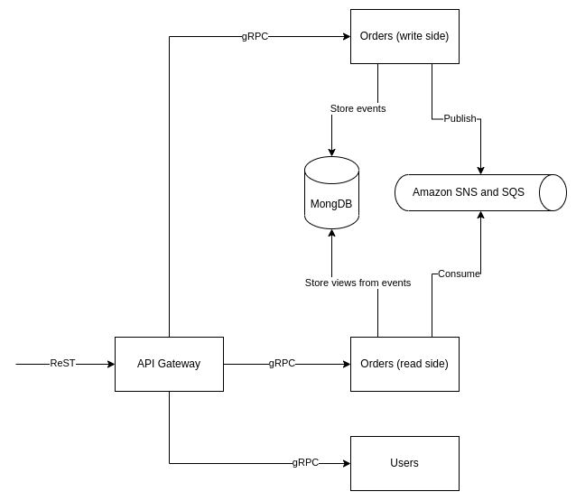

# What is this?

This is a repository to try out gRPC and Spring Reactor technologies.

# How the project is looking?

There are 4 "Microservices" (not really, but they will be deployed separately as Docker containers).

"API Gateway" is responsible for reading ReST request, asking "Users" service to decipher JWT and routing request to
"Orders (write side)" to perform some action or "Orders (read side)" to query some information.

"Users" is responsible for creating new users, logging in by username and password, deciphering user's information from
JWT.

"Orders (write side)" is responsible for adding/removing items for purchase, adding/removing items to/from user's cart,
closing orders.

"Orders (read side)" is responsible for viewing information about user's cart, closed orders, most purchased items.

To build these services Spring Reactor will be used alongside with gRPC for communication between them. Apache
Kafka and MongoDB were chosen mostly of their reactive driver support.

# User stories

1) Admin can add new item for purchase.
2) Admin can disable purchasing of an item.

# What have I learnt?