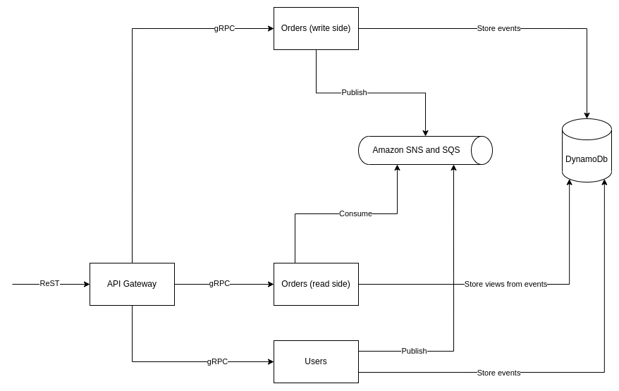

# What is this?

This is a repository to try out gRPC and Spring Reactor technologies.

# How the project is looking?

 TODO: Users uses DB

There will be 4 "Microservices" (not really, but they will be deployed separately as Docker containers). I will
utilize Ports and Adapters architecture, which will enable TDD approach in developing business logic. I will try CQRS
pattern to separate write side from read side for functionality related to creating orders and managing items to buy.

"API Gateway" is responsible for reading ReST request, asking "Users" service to decipher JWT and routing request to
"Orders (write side)" to perform some action or "Orders (read side)" to query some information.

"Users" is responsible for creating new users, logging in by username and password, deciphering user's information from
JWT.

"Orders (write side)" is responsible for creating new items for purchase, activating/deactivating items, adding/removing
items to/from user's cart, ordering items in cart.

"Orders (read side)" is responsible for viewing information about available items, user's cart, previously ordered
items, top ordered items.

To build these services Spring Reactor will be used alongside with gRPC for communication between them.

# User stories

1) Anyone can register.
2) Anyone can log in.
3) Admin can create new item for purchase.
4) Admin can deactivate active item.
5) Admin can activate deactivated item.
6) Regular user can add active item to cart.
7) Regular user can remove item from cart.
8) Regular user can order items in cart, if it contains any.
9) Any user can view all items.
10) Regular user can view his cart.
11) Admin can view top ordered items.
12) Regular user can view his previous ordered items.

# API

* Register

```bash
curl -i -X POST -H "Content-Type:application/json" "http://localhost:8080/users" -d '{"username":"admin","password":"pass","userType":"ADMIN"}'
```

* Log in

```bash
curl -i -X POST -H "Content-Type:application/json" "http://localhost:8080/users/login" -d '{"username":"admin","password":"pass"}'
```

* Create item

```bash
curl -i -X POST -H "Content-Type:application/json" -H "Authorization:{admin jwt}" "http://localhost:8080/items" -d "item"
```

* View all items

```bash
curl -i -X GET "http://localhost:8080/items"
```

* Deactivate item

```bash
curl -i -X POST -H "Authorization:{admin jwt}" "http://localhost:8080/items/{item id}/deactivate"
```

* Activate item

```bash
curl -i -X POST -H "Authorization:{admin jwt}" "http://localhost:8080/items/{item id}/activate" 
```

* Add items to cart

```bash
curl -i -X POST -H "Content-Type:application/json" -H "Authorization:{regular user jwt}" "http://localhost:8080/cart/add" -d '{"itemId":"{item id}","quantity":"1"}'
```

* Remove items from cart

```bash
curl -i -X POST -H "Content-Type:application/json" -H "Authorization:{regular user jwt}" "http://localhost:8080/cart/remove" -d '{"itemId":"{item id}","quantity":"1"}'
```

* View items in cart

```bash
curl -i -X GET -H "Authorization:{regular user jwt}" "http://localhost:8080/cart"
```

* Order items in cart

```bash
curl -i -X POST -H "Authorization:{regular user jwt}" "http://localhost:8080/cart/order"
```

* View previous orders

```bash
curl -i -X GET -H "Authorization:{regular user jwt}" "http://localhost:8080/orders"
```

* View top ordered items

```bash
curl -i -X GET -H "Authorization:{admin jwt}" "http://localhost:8080/items/top"
```

# How to test?

Execute [script](build-images.sh) to build service images, required to test api-gateway. Then execute test task:

```bash 
./gradlew test
```

# How to run?

Simply use [compose file](docker-compose.yml):

```bash 
docker compose up -d
```

# What have I learnt?

* Organizing aggregates in case of Event Sourcing.
* Building functional endpoints with Spring WebFlux.
* Working with reactive repository.
* Using custom images in Testcontainers.
* Using gRPC for communication between services.
* Managing dependencies with catalog versions in Gradle.
* Establishing CI/CD pipeline with GitHub Actions.
* Working with Amazon infrastructure: SNS, SQS, DynamoDB.
* Working with Terraform

# Out of scope concerns

* Optimistic locking, regarding events with the same version.
* Separation of writing events to database and their publishing, which can lead to interested parties not knowing about
  something important happened. Can be resolved with Outbox pattern, I guess.
* Proper logging.
* Proper exception handling.
* Following ReST conventions.